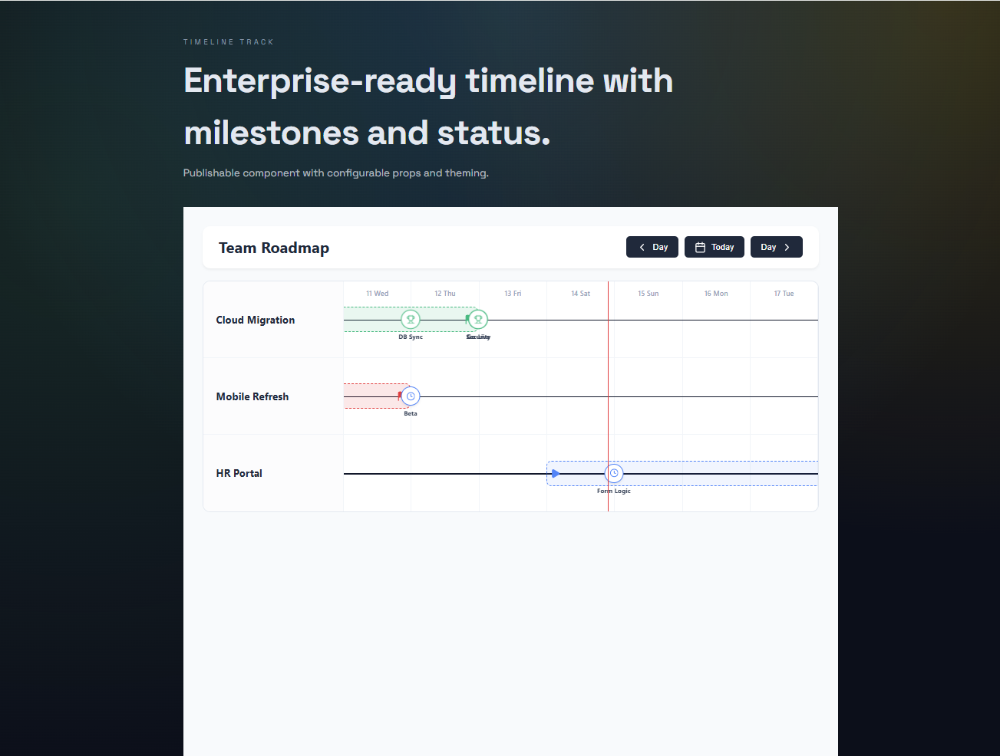

# Timeline Track

Enterprise-ready React timeline component for projects and milestones, with status-aware colors and range navigation.



## Install

```bash
npm i @shivamjadhav/timeline-track
```

## Usage

```tsx
import { TimelineTrack, type Project } from '@shivamjadhav/timeline-track';

const projects: Project[] = [
  {
    id: 'p1',
    projectName: 'Cloud Migration',
    projectStart: new Date('2026-02-10'),
    projectEnd: new Date('2026-02-14'),
    milestones: [
      { id: 'm1', name: 'DB Sync', endDate: new Date('2026-02-13'), status: 'success' },
      { id: 'm2', name: 'Security', endDate: new Date('2026-02-14'), status: 'success' },
    ],
  },
];

export default function Example() {
  return <TimelineTrack projects={projects} />;
}
```

## Props

- `projects` (required): `Project[]`
- `viewDate`: `Date` (controlled view date)
- `onViewDateChange`: `(date: Date) => void`
- `windowDays`: number (default `7`)
- `showTodayLine`: boolean (default `true`)
- `sidebarWidth`: number (default `220`)
- `rowHeight`: number (default `120`)
- `rangeIconSize`: number (default `16`)
- `showHeader`: boolean (default `true`)
- `title`: string (default `Team Roadmap`)
- `prevLabel`: string (default `Day`)
- `nextLabel`: string (default `Day`)
- `todayLabel`: string (default `Today`)
- `colors`: partial theme override
- `className`: string

## Types

```ts
export type MilestoneStatus =
  | 'completed'
  | 'success'
  | 'cancelled'
  | 'pending'
  | 'in-progress';

export interface Milestone {
  id: string;
  name: string;
  endDate: Date;
  status: MilestoneStatus;
}

export interface Project {
  id: string;
  projectName: string;
  projectStart: Date;
  projectEnd: Date;
  milestones: Milestone[];
}
```

## Build

```bash
npm run build
```

## License

MIT
